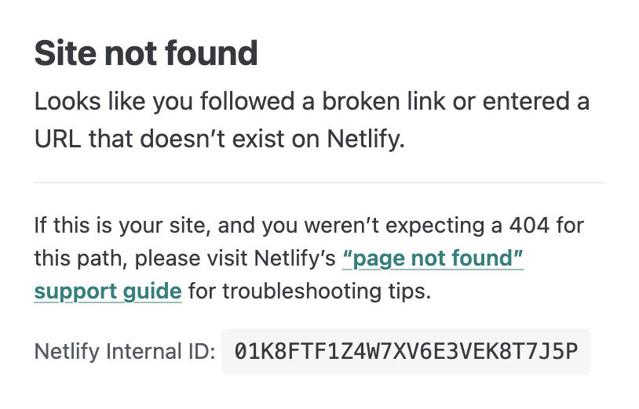

# React Deployment with Netlify


[This lesson](https://netlifyreactdeployment.netlify.app/) will walk you through the steps to deploy a [Vite](https://vitejs.dev/) React app with [Netlify](https://www.netlify.com/). We will walk through all of the necessary steps from start to finish, and even cover how you can choose a custom domain as well.


## Objectives

- Do a one-time [login](#log-in-to-netlify) to Netlify on your machine
-
- [Deploy](#deploy) your app to Netlify
- [Build](#build-a-production-version-of-your-app) a production version of your app
- Learn how to set up a custom domain ([optional](#setting-up-a-custom-domain-optional))
- Create a custom build script ([optional](#creating-a-custom-build-script))


## Is a React App a Static Site?

When we use the term "static", we are referring to the fact that the content of the website will not change unless the files are manually updated. The site does *not* interact with a database or involve any [server-side processing](https://en.wikipedia.org/wiki/Server-side). The site will simply display the same information to every user. Typically, static sites are faster and more secure than dynamic sites.

Technically, a React front-end is considered a static site because it serves pre-built files to the browser, and all necessary data is included within the initial load, meaning it doesn't need to query a database or server for every user request. The dynamic interactions are handled through JavaScript ([client-side](https://en.wikipedia.org/wiki/Dynamic_web_page)) which manipulates the DOM elements directly in the browser, without needing to fetch new pages or data from a server. This results in faster load times and a smoother user experience.

This also means that we can use Netlify to deploy it!

Netlify has a free tier, and the feature we love the most is that it is extremely *easy to use*.


## Log In to Netlify

First off, we need to do a one-time login to Netlify on our machine. This should only need to be done once.


### Setting Up Your Netlify Account

***If you have never signed up with Netlify before...***

Visit [Netlify](https://app.netlify.com/signup) to sign up for a new account.

***After signing up...***

Run the following command from *any working directory* in your terminal:

```sh
npx netlify login
```

Your browser should open to sign in to your Netlify account. Then, click "Authorize".


## Build A Production Version of Your App

Now, you need to tell Vite to build a production version of your app. If you intend on using a custom domain, [skip ahead](#custom-domain) to that section. If not, run the following:

```sh
vite build
```

Running the `vite build` command creates a production build of our React App contained in a `/dist` folder. Netlify will use this to deploy our app.


## Deploy

You'll need to create a `netlify.toml` file in the root of your project to tell Netlify how to work with Vite.

```sh
touch netlify.toml
```

In this file, paste in the following settings:

```txt
[build]
  command = "npm run build"
  publish = "dist"

[[redirects]]
  from = "/*"
  to = "/index.html"
  status = 200
```

If you want to choose a custom domain, skip to the [next step](#setting-up-a-custom-domain-optional), otherwise you're ready to deploy. Run the following command in the root folder of your project:

```sh
npx netlify deploy --dir=dist --prod
```

If this is your first deployment, Netlify will assign a random URL to the site. You can change this in the next step.


## Setting Up a Custom Domain (optional)

We can choose the particular domain you want to use with Netlify. This step is entirely optional.

When you first deploy, you'll simply add a `--name` flag to your script. But first, we'll choose a domain.


### Choose a Domain

First, we'll need to see that the URL you want to use is available. Open a browser window and navigate to any Netlify domain you'd like.

The URL should follow this format:

```txt
https://netlifyreactdeployment.netlify.app/
```

If it's available, the URL should show this or something very similar in the browser:



This means that no one else has deployed a project to this URL, and that it is available to be used. Remember this URL for the next step.

```sh
npx netlify deploy --create-site <NETLIFY-URL> --dir=dist
```

Obviously replace the **<>** in the above script with your own information.

Your ***Netlify URL*** is what will be used as the entry point to your app. This is what people will see, and the one you'll want to put on your portfolio, LinkedIn, etc.

You will only need to set this once.


### Creating A Custom Build Script

Next, we'll create or modify the "build" script in our **package.json** that will perform all of the steps we need to run our deployment.

Add the following script ***in*** your `"scripts"` section of your `package.json` file.

If you already have a "build" script, replace it with this:

```json
"build": "vite build && npx netlify deploy --dir=dist --prod"
```

This script performs the following actions:

1. Runs the *vite build* command that creates a production build of your React App contained in a **/dist** folder
2. Runs the *netlify* command to redeploy your app


## Re-Deploy

Any time you want to deploy, run the custom script you put in your `package.json` file. Do so from the root of your project:

```sh
npm run build
```

This will run the deployment of our Vite React App to Netlify.


## Recap

In this walkthrough, you successfully deployed your Vite React app to Netlify.

Any time you make changes to your project that you want reflected on your deployed version, just commit your changes and then run `npm run build` once more.

## Resources

- [Vite Docs](https://vitejs.dev/guide/)
- [Netlify Docs](https://docs.netlify.com)
- [Deploy It!](https://deployit.surge.sh/)
